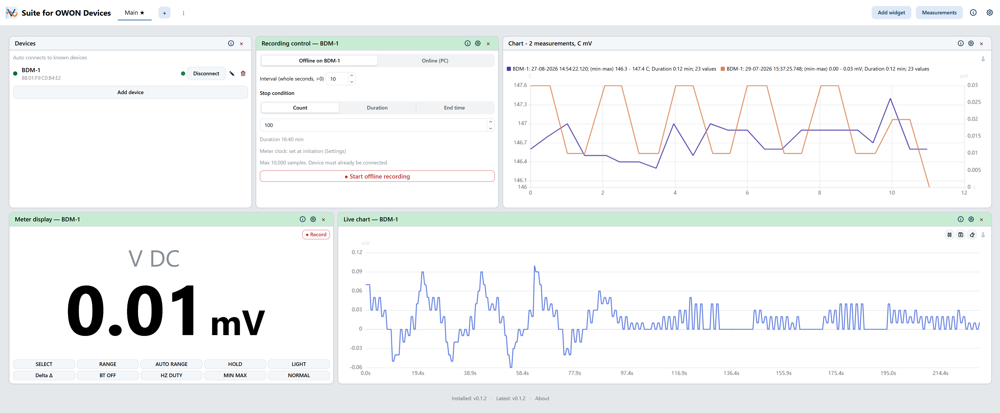
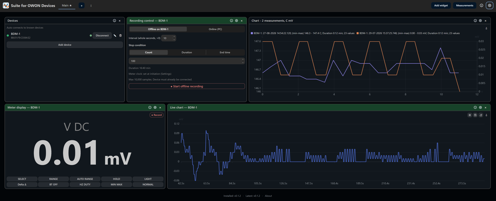
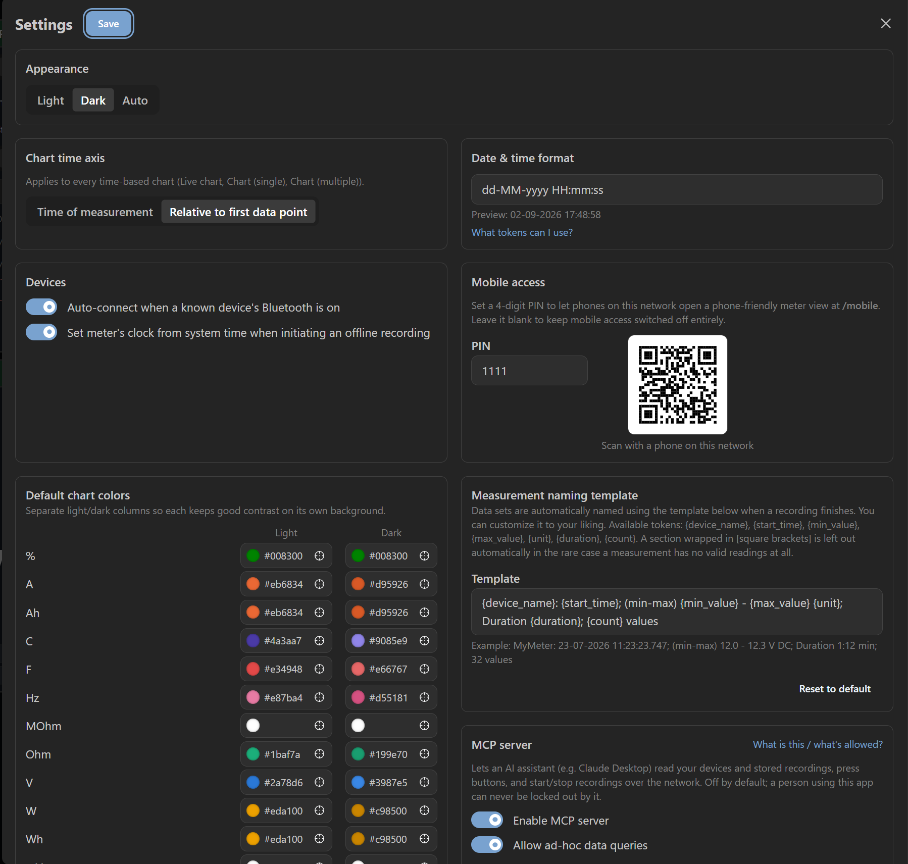
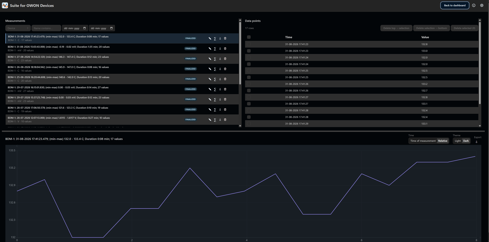
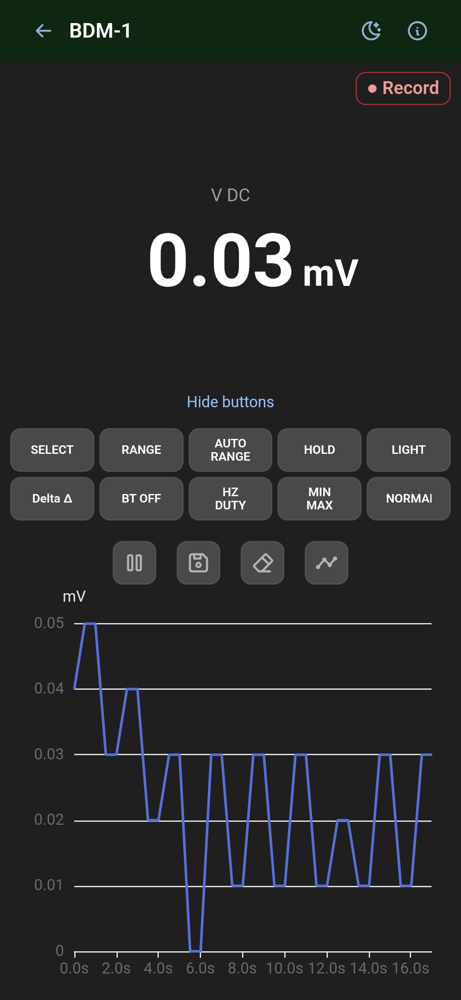

# Suite for OWON Devices

A desktop app for OWON BLE digital multimeters — live readings, device
control, long-term recording, data visualization, calculations, and an MCP
server for AI-agent access. Runs locally in your browser; no cloud account,
no data leaving your PC.

Built to be cross-platform (Windows and Linux) — the backend is plain
Python/FastAPI and `bleak` (the BLE library) supports both WinRT and BlueZ
under the hood — but **only Windows has actually been tested so far**. The
one-step installer (`install.ps1`) is Windows-only today; Linux is currently
"should work, run it from source" rather than a supported, tested path. See
[Building from source](#building-from-source) below.

Currently targets the **OWON B41T+**. The BLE protocol was independently
reverse-engineered and validated against real hardware (see
[`docs/protocol-spec.md`](docs/protocol-spec.md)).



## What it does

- Auto-connects to registered OWON B41T+ devices over Bluetooth — live value
  display, Hold/Range/backlight/Bluetooth-off and other button-equivalent
  controls. Signals if new OWON devices are found.
- A customizable multi-widget dashboard: live chart, meter display,
  recording control, device list, charts — drag/resize/place, multiple
  self-configurable dashboards, mobile (browser) app.
- Three recording modes: **ad-hoc** (the Record button starts an instant
  recording), **online** (PC-timed, live-streamed to the app), and
  **offline** (the meter records standalone; data downloads automatically on
  reconnect).
- Built-in calculations (Ah, Wh, shunt current `I = U / R`) with time-series
  alignment/interpolation between differently-sampled measurements.
- CSV export, and chart image export (PNG/JPEG/SVG).
- A local **MCP server** so an AI assistant (e.g. Claude Desktop) can read
  live values and stored recordings, and — if you choose to enable it —
  control the meter and recordings too.

## Limitations

- **Only tested on Windows 10/11.** The app is written to be cross-platform
  and `bleak` supports Linux (BlueZ) natively, but that path hasn't been run
  or verified yet — treat Linux as untested, not unsupported. There's no
  one-step installer for Linux yet; see
  [Building from source](#building-from-source).
- **OWON B41T+ only, today.** The architecture (see
  [`architecture.md`](architecture.md) §9) leaves room for other
  brands/instrument types, but nothing else is implemented yet.
- Needs a working Bluetooth Low Energy adapter on the PC.
- Early-stage project — expect rough edges, and please open an issue if you
  hit one.

## Install

Two ways to run the installer — both end up running the exact same script,
pick whichever you're more comfortable with.

**Option A — one command, nothing to download first:**

Open PowerShell (Start menu → search "PowerShell") and paste:
```powershell
irm https://raw.githubusercontent.com/pjpa365/owon-suite/master/install.ps1 | iex
```

**Option B — download it first, then run it** (if you'd rather look at the
script before running it):

1. Download [`install.ps1`](install.ps1)
2. Open PowerShell in the folder you downloaded it to, and run:
   ```powershell
   powershell -ExecutionPolicy Bypass -File .\install.ps1
   ```

Either way, you'll be asked a few questions (install folder, port, Start
Menu shortcut, optional Windows Service, optional auto-start on boot) —
defaults are sensible for most people, just press Enter.

The installer checks for a Bluetooth adapter and for Python (installing it
via `winget` if missing), downloads the latest release, and leaves the app
running. It prints the URL to open and how to (re)start it next time.

The installer is unsigned, so Windows SmartScreen may show an "unknown
publisher" warning the first time — click **More info → Run anyway** to
proceed.

## Building from source

The only Windows-specific pieces are `install.ps1`/`build-release.ps1`
(PowerShell) and `backend/requirements-lock.txt` (a pinned dependency
freeze captured on Windows, so it includes Windows-only wheels like
`pywin32`/`winrt-*`) — use plain `requirements.txt` instead on Linux, which
lets `pip` resolve the right platform-specific packages itself.

**Windows:**
```powershell
cd backend
python -m venv .venv
.venv\Scripts\pip install -r requirements.txt
.venv\Scripts\python run.py          # dev server, http://127.0.0.1:10765

cd ..\frontend                       # separate terminal
npm install
npm run dev                          # dev server, http://127.0.0.1:5173
```

**Linux (untested, should work):**
```bash
cd backend
python3 -m venv .venv
.venv/bin/pip install -r requirements.txt
.venv/bin/python run.py              # dev server, http://127.0.0.1:10765

cd ../frontend                       # separate terminal
npm install
npm run dev                          # dev server, http://127.0.0.1:5173
```

`build-release.ps1` builds the frontend and packages a distributable
release zip (what `install.ps1` downloads) from a working checkout —
Windows-only for now, same as `install.ps1` itself.

## Screenshots

**Dashboard** — customizable widgets: devices, recording control, charts,
live meter display (dark mode; see light mode above)



**Settings** — appearance, chart formatting, per-unit chart colors, mobile
access QR code, MCP server toggle



**Data admin** — browse, filter, chart, and manage stored measurements



**Mobile client** — phone-friendly meter view, reachable via the QR code
above



## Acknowledgments

- **OWON** — this project targets OWON's B41T+ hardware. It is an
  independent, community project, not affiliated with or endorsed by OWON.
- **[jtcash/OwonB41T](https://github.com/jtcash/OwonB41T)** and
  **[DeanCording/owonb35](https://github.com/DeanCording/owonb35)** — two
  independent prior open-source projects whose protocol writeups made this
  project's BLE reverse-engineering possible without sniffing traffic from
  scratch.
- Built on: [FastAPI](https://fastapi.tiangolo.com/),
  [Uvicorn](https://www.uvicorn.org/), [DuckDB](https://duckdb.org/),
  [bleak](https://github.com/hbldh/bleak),
  [Model Context Protocol](https://modelcontextprotocol.io/),
  [sqlglot](https://github.com/tobymao/sqlglot) (backend); React, Mantine,
  [Apache ECharts](https://echarts.apache.org/), TanStack Query, Zustand,
  react-grid-layout, dayjs, date-fns, Tabler Icons (frontend). Thank you to
  the authors and maintainers of all of these.

## License

[PolyForm Noncommercial License 1.0.0](LICENSE) — free to use, study, and
modify for any noncommercial purpose. Commercial use requires the
copyright holder's permission.
